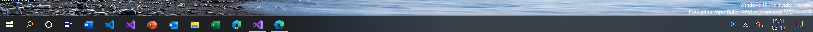

# DelV
## A working taskbar replacement, mimicking the Windows 10 taskbar down to the acrylic.

 
<h3>Features</h3>
<ul>
<li><b>Supports Acrylic on supported versions of Windows 10 (FCU onwards)</b>
<li>Functional buttons (Start,Search,Cortana,Timeline/Task View,Network,Whiteboard,Clock,Action Center,Peek Desktop)
<li>The wifi signal indicator actually does its job.
<li>Gets all the open windows (like the normal taskbar)
<li>Can launch apps and bring apps to front
<li>Displays your pinned apps and can launch them
<li>Emulates the real thing as close as possible
<li>Hides your actual taskbar (literally, this is not like "auto hide taskbar" - if you dont exit the app properly, your taskbar wont come back on its own!)
</ul>
<h3>Limitations</h3>
<ul>
<li><h4><i>Dont try to count them there are lots</i></h4>
<li>Its.. umm.. <b>s l o w</b>
<li>UWP apps sometimes do not show up, and are not pinned. (You can pin a shortcut of the UWP app, however, and wont notice any difference)
</ul>
<h3>FAQ</h3>
<b>Q: I closed the app (through task manager or alt+f4 or something) and now my actual taskbar has dissapeared. How do i fix it?</b> 
A: Either restart the app and then close it using the 'X' button on it <b>or</b> log out and then log back in <b>or</b> restart your computer. 
 
<b>Q: How do i enable acrylic in my win32 app?</b> 
A: See <a href="https://github.com/at-adityavikram/Acrylic4VBWIn32">here</a> for a comprehensive demonstration. 
 
<h3>Download pre-built <a href="https://drive.google.com/drive/folders/1ZHiY75_M_D1Q9WXsIuxPQfqI4Wk22YXR?usp=sharing">here.</a></h3>
